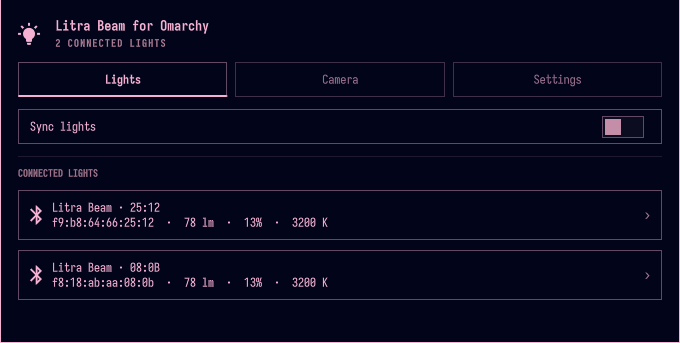
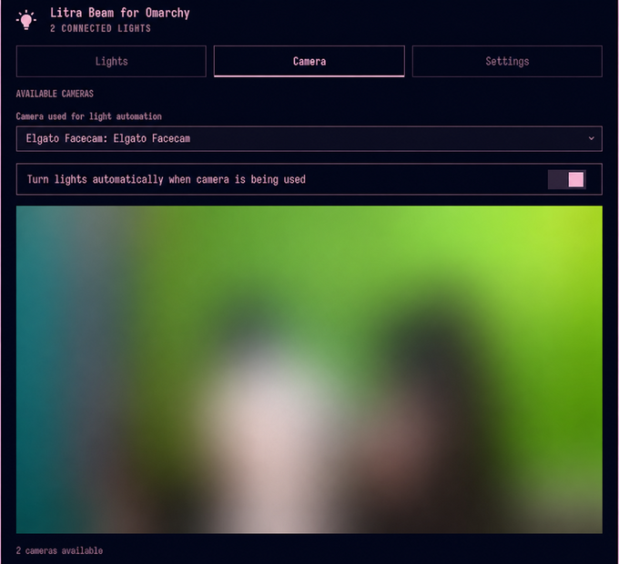
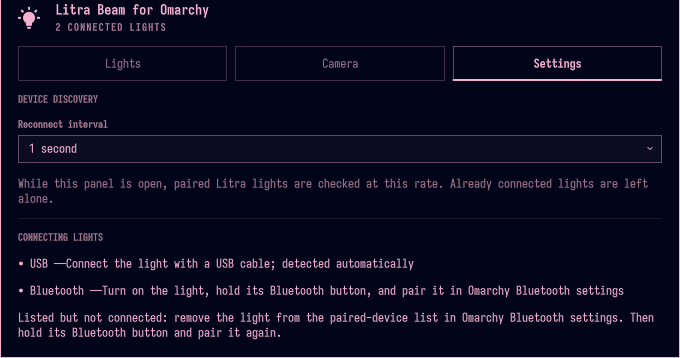

# Litra Beam for Omarchy

An Omarchy shell plugin for controlling one or many Logitech Litra Beam lights over USB or Bluetooth. It follows the same service/view/bar/overlay architecture as the Yamaha MG-XU plugin.

The panel has **Lights**, **Camera**, and **Settings** tabs. Lights contains the direct and synchronized controls. Camera provides a live preview of the selected Qt Multimedia camera and remembers the selection. It detects both its own preview and direct V4L2 or PipeWire use by other applications; when the camera is externally busy, the preview reports that another application is using it. The persisted **Turn lights automatically when camera is being used** toggle powers all connected lights on while the selected camera is in use and powers them off when it is no longer in use.

The **Sync lights** toggle is shown when more than one light is connected and is off by default. If the connected group drops to one light, sync is automatically turned off and the remaining light is treated as an individual device. When sync is off, the panel lists every connected light and opens separate controls for the selected device. When enabled, the first powered-on light is the master: its current power, brightness, and temperature are immediately copied to the remaining lights, and subsequent changes apply to the group.

Brightness uses the HID++ illumination capability data. The slider stops at each light's `effective maximum`, which can be lower than its nominal 400-lumen maximum when the USB supply cannot provide enough power. In sync mode it stops at the lowest effective maximum in the group.

## Supported hardware

This plugin is currently developed and tested with the non-RGB **Logitech Litra Beam LED Streaming Light**, which is the hardware available to the project. RGB Litra models are not currently supported or represented by the existing controls.

RGB-specific features can be added once the project has access to an RGB model and can test its capabilities and behavior on real hardware.

## Workflow

### 1. Connect the lights

- **USB:** connect a Litra Beam directly; the plugin detects it automatically.
- **Bluetooth:** hold the light's Bluetooth button for approximately three seconds, then pair it in Omarchy Bluetooth settings. While the panel or app is open, the plugin reconnects paired lights at the interval configured in Settings.

### 2. Control lights independently or together

The Lights tab lists every connected light with its transport, brightness, effective lumen output, and color temperature. Select a light to control its power, brightness, and temperature independently. With multiple lights connected, enable **Sync lights** to copy the first powered-on light's state to the group and apply subsequent changes to every light.



Brightness respects each light's reported power limit. In synchronized mode, the lowest effective maximum among the connected lights becomes the group limit.

### 3. Automate lights from camera activity

In the Camera tab, select the camera that should drive automation and enable **Turn lights automatically when camera is being used**. The plugin turns all connected lights on while that camera is active and turns them off when it is no longer in use. It recognizes both the built-in preview and camera use by external V4L2 or PipeWire applications.



The camera content in this documentation screenshot is intentionally blurred for privacy.

### 4. Tune discovery and recover Bluetooth devices

The Settings tab controls how often the open panel checks paired Bluetooth lights. It also provides separate connection guidance for USB and Bluetooth devices. If a paired Bluetooth light remains listed but will not connect, remove it from Omarchy Bluetooth settings and pair it again.



## Install

```bash
git clone https://github.com/ErickRodrCodes/litra-beam-for-omarchy.git \
  ~/.config/omarchy/plugins/io.github.tbogard.litra-lights
omarchy plugin enable io.github.tbogard.litra-lights right
~/.config/omarchy/plugins/io.github.tbogard.litra-lights/scripts/install-app.sh
```

After installation, follow the workflow above to connect the lights and configure camera automation.

## Validate

```bash
omarchy plugin validate .
qmllint -I "$OMARCHY_PATH/shell" Service.qml BarWidget.qml Panel.qml App.qml LitraView.qml LightControls.qml CameraAutomation.qml LitraSettings.qml PowerLimitedSlider.qml
python3 -m py_compile scripts/litra-control.py
```
